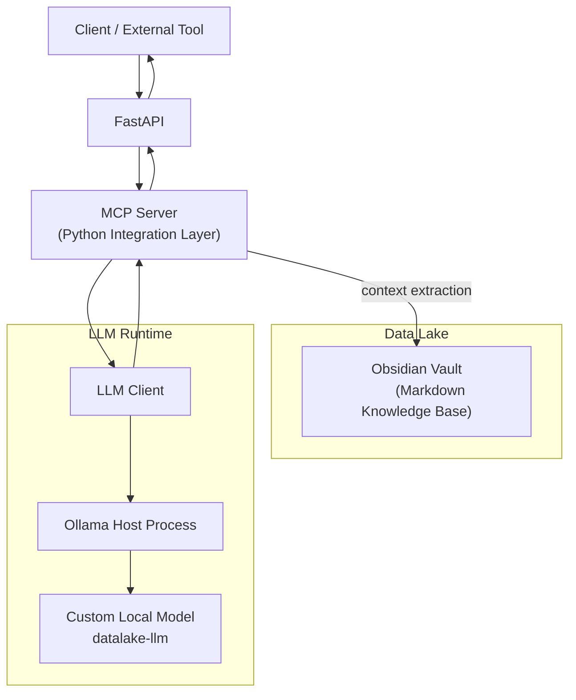

# README.md

最終目標: 私はたのしいPoCだけやって仕事はLLMにさせたい

# Local Knowledge LLM Stack

Obsidian × MCP × FastAPI × Ollama

このリポジトリは **Obsidian Vault をローカル LLM の知識源として扱い、FastAPI を通じて統合的に利用できる環境** を提供します。
外部情報への依存を避け、**自分自身で検証した情報に基づく回答を返すローカル AI** を作ることを目的としています。

---

## Goals

1. **Obsidian Vault をデータレイク化する**
   Markdown で蓄積したナレッジを、構造化検索や文脈抽出に利用できる形にする。

2. **ローカル LLM と Vault を統合する**
   モデルは一般知識を持ちながら、Vault に存在しない情報については
   「存在しない」と判断できる動作を目指す。

3. **FastAPI をフロントとして問い合わせ口を統一する**
   他ツール・UI・スクリプトからシンプルに叩ける仕組みを用意する。

4. **MCP（Python）を仲介レイヤーとする**

   * Vault 読み取り
   * 文脈抽出
   * プロンプト組み立て
   * LLM 呼び出し
     を一箇所に集約する。

5. **Ollama をローカル LLM ランタイムとして採用する**
   モデルの生成・更新はホスト側で行い、Docker のビルドフローと同期させる。

---

## Architecture (Mermaid)



---

## Repository Structure

後で自由に広げられるよう、最小構成を示しています。

```
repo-root/
├── mcp/                     # MCP server (Python)
│   ├── server.py           
│   ├── llm_client.py       
│   ├── vault_reader.py     # Vault 読み取り・文脈抽出
│   ├── main.py             
│   └── requirements.txt
│
├── vault/                   # Obsidian Vault (データレイク)
│   └── ... 
│
├── scripts/
│   └── create_model.py      # ollama create を実行
│
├── .devcontainer/
│   ├── devcontainer.json
│   ├── docker-compose.yml
│   └── Dockerfile
├── Makefile
└── README.md
```

---

## Design Principles

### 1. **Vault は「検証済みのデータソース」になる**

LLMは古くて使えない情報や似た別の情報を引っ張ってきたりするので、
ユーザー自身が検証した情報のみを参照することを最優先にしています。

### 2. **MCP に責務を集約する**

* Vault の探索
* 文脈抽出（単純検索〜埋め込み利用）
* プロンプト組み立て
* LLM 呼び出し
  を MCP が一手に引き受けます。

FastAPI は I/O に徹し、ビジネスロジックは MCP に寄せる構成です。

### 3. **LLM のシステム方針はモデル生成フェーズで固定する**

問い合わせごとに巨大なプロンプトを送らずに済むよう、
システムプロンプトとして焼き込む方針を採っています。

```sh
 curl http://localhost:11434/api/create -d '{
   "from": "gemma3",
   "model": "alpaca",
   "system": """\
 あなたは以下の要件に厳密に従って回答します：
 1. 一般常識は使用してよい。
 2. ただし回答の根拠として使用してよい情報は、渡された「データレイクの内容」のみ。
 3. データレイクに該当情報が無い場合は「データレイクに情報がありません」と必ず言う。
 4. 不確かな推測はしない。
 """
 }'
```

### 4. **モデル生成は Dockerfile ではなく、ホストで行う**

Ollama はホストで動いているため、
`scripts/create_model.py` で管理し、
Docker のビルドフローと同期させます。

---

## Setup Flow

セットアップの意図だけ書き、細部は後で埋められるようにしています。

1. **Obsidian Vault を配置する**
   `vault/` ディレクトリにそのまま置く。

2. **Ollama をインストール**
   ホストマシンで動作。

3. **モデル生成スクリプトを実行**

   ```
   ./scripts/create_model.py
   ```

4. **docker-compose を起動**
   FastAPI + MCP が立ち上がる。

